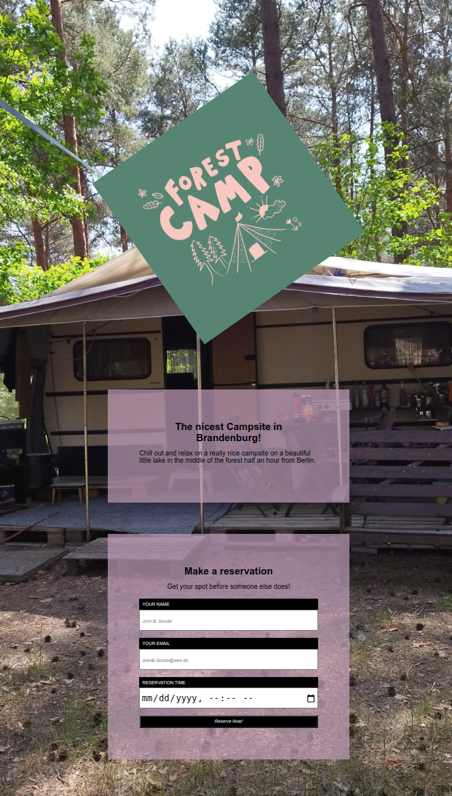

# Registration-form for a Campsite

## Exercise Course-Module 1 - UserInterfaceBasics (UIB) - HTML/CSS

### Basic Data Exercises - Styling Forms

created at 15.09.22;

Created a basic HTML page with a variety of different elements and a form styled like the mockup in the images-folder.

#### My desktop version:

#### My mobile version:

#### Mockup

